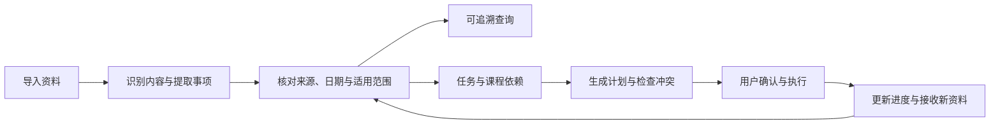

# CampusFlow

**校园学习事务智能助理：把分散的课程资料和通知，整理成有依据、可执行的学习安排。**

CampusFlow 面向学生日常学习中的信息整理与时间管理需求，连接培养方案、课程大纲、教务通知、作业要求和群聊截图，帮助回答三个问题：

- **我需要知道什么？** 查清课程要求、截止时间和办事规则，并找到原文依据。
- **我应该先做什么？** 理清课程和任务的前置关系，形成可解释的执行顺序。
- **接下来怎么安排？** 根据个人时间、任务依赖和截止日期制定计划，发现冲突并跟进变化。

> **项目状态：业务规划阶段。** 本文定义拟建设的产品功能、业务规则和分阶段范围，不代表功能已经实现。当前仓库尚无可运行应用；具体技术选型与部署方式将在业务范围确定后补充。

## 1. 产品定位与服务对象

CampusFlow 以学生个人工作空间为基本单位，提供从学习资料到个人行动的完整流程。

| 服务对象                 | 典型困扰                                       | 预期价值                                 |
| ------------------------ | ---------------------------------------------- | ---------------------------------------- |
| 在校学生                 | 课程信息散落在文件、网页和群聊中，容易遗漏要求 | 集中整理，快速查询原文与关键事项         |
| 同时修读多门课程的学生   | 作业、考试和实验相互挤占时间                   | 统一查看任务与时间安排，提前发现冲突     |
| 规划修课与长期学习的学生 | 不清楚先修关系、开课条件和阶段要求             | 展示课程依赖与缺失条件，辅助制定修读顺序 |

首期聚焦个人学习事务。教师协作、班级管理和学校级教务管理属于后续独立评估范围。

### 产品原则

1. **回答有依据。** 涉及课程要求、日期、规则和依赖关系的事实必须关联来源；没有证据时明确说明。
2. **区分事实与建议。** 原文规定、用户补充、系统推断和规划建议分别标注。
3. **不确定信息可处理。** 缺少年份、截图不完整、版本冲突等情况进入待核对状态，不以猜测代替确认。
4. **安排由用户掌控。** 计划先生成草案；写入外部日历、发送消息、删除资料等敏感操作需明确确认。
5. **变化可追踪。** 保留资料版本、规则变化与计划调整依据，避免旧通知继续影响当前安排。

## 2. 核心业务场景

| 场景         | 用户输入示例                             | 预期输出                                           |
| ------------ | ---------------------------------------- | -------------------------------------------------- |
| 查询课程要求 | “数据库第二次作业什么时候交，交到哪里？” | 截止时间、提交方式、适用对象、原文位置与待核对项   |
| 整理群聊通知 | 上传一组课程群截图                       | 提取作业、考试、变更通知，逐项核对课程和日期       |
| 安排近期学习 | “根据这些资料，安排未来两周的学习。”     | 任务清单、建议时间块、安排理由与无法排入的任务     |
| 检查日程冲突 | “周三实验会不会和考试冲突？”             | 重叠时段、涉及事项、各自来源与处理建议             |
| 梳理修课顺序 | “这些课程应该按什么顺序学？”             | 有证据支持的先修关系、可行顺序、缺失条件及限制说明 |
| 跟进通知变化 | 上传一份修改后的考试通知                 | 新旧信息差异、受影响任务与待确认调整方案           |
| 查询实验要求 | “进入实验室之前要准备什么？”             | 准入条件、必备材料、操作限制及对应原文             |

## 3. 业务闭环

用户可以只查询资料，也可以从已有任务直接制定计划，不必每次走完整个流程。存在歧义的事项可以保存，但必须保留待核对标记，避免被当作已确认的约束使用。

## 4. 功能规划

### 4.1 学期与课程工作空间

- 按学期管理课程、资料、任务和日程，支持归档历史学期。
- 保存课程名称、课程代码、教师、教学班等信息；同名不同教学班分别识别。
- 支持课程别名，将群聊中的简称与正式课程关联；无法唯一匹配时请求核对。
- 维护用户所属年级、专业、培养方案版本和已修课程，判断通知适用范围与先修条件。
- 设置时区、每周可用时段、固定课程、休息时间和学习偏好，供后续排期使用。

### 4.2 资料收集与管理

**拟支持的输入：** PDF、Word、图片与群聊截图、网页通知链接、粘贴文本。网页优先处理公开可访问内容；需要登录或无法读取的页面允许改用上传文件或粘贴原文。

- 资料可归入课程或学期公共资料区，记录标题、发布方、发布时间、导入时间和来源链接。
- 识别文字、表格与扫描内容，保留页码、段落或截图区域等定位信息。
- 展示导入状态：待处理、处理中、完成、部分成功、失败；失败时提供原因和可用的重试方式。
- 检查重复资料和重复事项，建议复用或合并；相似但不同版本的通知不得直接覆盖。
- 支持补充来源信息、重新归类、归档和删除。归档用于保留历史，删除前说明对引用和关联事项的影响。

导入不等于认可内容有效。每份资料都需要保留适用学期、对象与版本信息，防止上一学期或其他教学班的要求混入当前计划。

### 4.3 内容理解与事项提取

从资料中识别四类内容：

| 内容类型 | 主要字段                                             | 示例                             |
| -------- | ---------------------------------------------------- | -------------------------------- |
| 任务     | 所属课程、要求、截止时间、提交方式、产出物、前置条件 | 作业、实验报告、选课申请         |
| 日程     | 开始与结束时间、地点、参与条件、是否可调整           | 考试、实验课、答辩               |
| 规则     | 适用范围、生效时间、条件、限制、来源                 | 实验室准入、提交格式、考核要求   |
| 课程关系 | 前置课程、目标课程、关系类型、适用方案、来源         | 必修先修、并修要求、建议学习顺序 |

- 每条提取结果展示原文片段和定位，允许用户修改、确认、忽略或合并。
- 明确区分“截止前完成”和“在指定时段参加”，避免将作业 DDL 错当成固定日程。
- 识别“下周五”“第八周”等相对时间，仅在发布日、校历等依据充分时转换为明确日期，并展示换算依据。
- 未写年份、具体时刻或提交方式时保留缺失项，不默认补成确定事实。
- 原文没有预计耗时的任务，可以请求用户补充或给出可修改的估计，明确标为规划估计。
- 内容中出现的命令仅作为资料处理，不作为执行系统操作或向外发送信息的授权。

### 4.4 有来源的自然语言查询

用户可以按课程、学期、资料类型和时间范围提问，也可以连续追问。

- 查询截止时间、提交要求、考试安排、课程考核、实验规定等信息。
- 对照多份资料汇总要求，展示一致信息、差异及适用范围。
- 通过 RAG 检索原文，回答关联到对应文件页码、段落、截图区域或网页位置。
- 使用 Agent 判断“查询信息”“制定计划”“检查冲突”等意图；混合请求可分步处理，执行动作仍受确认规则约束。
- 回答中显示资料覆盖范围。缺少课程资料时使用“现有资料中未发现”，不得断言“没有作业”。
- 无法确定的问题列出缺失依据与下一步核对方式；不得生成不存在的引用。

**答案示例结构：** 结论 → 适用课程与对象 → 原文依据 → 不确定项或冲突。用户应能从结论直接回到相应原文。

### 4.5 任务管理

- 从资料提取候选任务，也支持手动创建任务。
- 保存所属课程、截止时间、优先级、预计耗时、剩余耗时、依赖任务、来源和执行进度。
- 将大型任务拆分为阅读、准备、实现、检查、提交等子任务；系统生成的拆分属于可编辑建议。
- 支持完成、延期、取消与重新打开，并记录调整原因。
- 区分外部规定的截止时间和用户自己的计划完成时间；移动学习时间块不会修改原始 DDL。
- 用户调整自己的目标日期不需要外部依据；修改课程正式截止时间时需保留依据或标为个人备注。

信息核对状态与执行进度分别维护：候选事项可处于“待核对、已确认、已忽略、已失效”；正式任务可处于“未开始、进行中、受阻、已完成、已取消”。“已逾期”由截止时间和完成情况计算，不替代执行进度。

### 4.6 学习计划与时间安排

支持按今天、本周、未来两周或自定义区间生成计划。

**计划输入：** 已确认任务、固定日程、任务依赖、截止时间、剩余耗时、可用时间和用户偏好。

**排期规则：**

- 优先满足固定日程、明确截止时间和必要依赖等硬约束。
- 在可行范围内考虑紧急程度、任务重要性、用户偏好、连续学习长度和休息间隔。
- 对耗时未知或日期待核对的事项，列为待补充项；若用户选择暂按假设排期，明确展示假设。
- 为大任务预留检查和提交时间；缓冲时长允许用户调整。
- 时间不足时列出无法安排的任务、预计缺口与可调整选项，不生成看似完整但无法执行的计划。

**计划输出：** 分日任务、建议时间块、预计工作量、安排理由、风险与未排入事项。用户可以局部修改和锁定已接受的时间块，重新规划时尽量保留已确认安排。

计划先以草案呈现。用户接受后成为当前计划；未完成任务和新通知可以触发调整建议，已有安排的实质变化需再次确认。

### 4.7 冲突与风险检查

| 类型     | 判断内容                                       | 处理结果                                       |
| -------- | ---------------------------------------------- | ---------------------------------------------- |
| 时间重叠 | 两个固定事项同时发生，或学习时间块占用固定日程 | 展示重叠区间，建议移动可调整事项               |
| 截止风险 | 剩余可用时间不足以完成任务                     | 展示时间缺口，建议提前开始、拆分或调整个人计划 |
| 依赖冲突 | 后续任务早于前置任务完成，或修课条件未满足     | 标出阻塞关系与所缺条件                         |
| 信息冲突 | 多份有效资料对同一事项给出不同要求             | 并列展示证据，进入待核对状态                   |
| 负荷风险 | 单日或连续多日安排超出用户设定的学习容量       | 建议分散工作量并说明影响                       |

检查结果要区分确定的冲突与基于耗时估计的风险。缺少结束时间等必要字段时，说明哪些检查暂时无法完成，不把“未检出”解释为“没有冲突”。

### 4.8 课程依赖与修读路径

- 根据培养方案和课程大纲建立课程关系图，区分强制先修、并修条件与建议先学。
- 在适用培养方案一致、依赖无环的前提下，对强制先修关系给出拓扑排序；存在多个可行顺序时说明可替换部分。
- 标记已修、在修与待修课程，展示后续课程被哪些条件阻塞。
- 检测循环依赖、课程缺失和资料相互矛盾，不强行生成合法顺序。
- 结合开课学期、学分限制等已知规则辅助规划；缺少这些信息时只提供依赖层面的学习顺序。

课程关系图不能单独证明某个学期方案可以选课或满足毕业条件。完整培养方案审核与教务系统实际选课不纳入首期范围。

### 4.9 通知变更与计划维护

- 导入同一事项的新通知时，对比截止时间、地点、要求和适用对象等字段。
- 不以“导入更晚”作为新版生效依据；检查发布信息和明确的替代说明，无法判断时保留冲突。
- 展示受影响任务、时间块、提醒和外部日历事件，生成调整草案。
- 用户确认后更新当前版本，保留旧版本、变更理由与原文依据。
- 任务完成、剩余耗时增加或用户可用时间变化后，支持局部重排。

首期以用户主动导入新资料为变更入口。自动关注网页、自动抓取教务通知等能力需要另行评估访问权限、稳定性与更新频率。

### 4.10 提醒、导出与外部日历

- 在应用内集中展示近期截止、待核对事项、未解决冲突和计划变更。
- 后续提供可配置提醒，支持提前量、重复提醒、暂停和已完成任务自动停止提醒。
- 支持导出任务清单和日历草案，后续逐步接入外部日历。
- 写入外部服务前展示目标账户、新增或修改内容、时间与时区，由用户确认具体操作。
- 显示每条操作的成功或失败状态，允许只重试失败项，并防止重复创建。
- 外部写入失败不影响内部任务保存；只有实际成功的操作才能显示为已同步。

首期不自动发送群消息、提交作业、替用户选课或向教师申请延期。

## 5. 页面与信息组织

| 页面       | 主要内容                                 | 核心操作                         |
| ---------- | ---------------------------------------- | -------------------------------- |
| 总览       | 近期任务、今日安排、待核对信息、冲突提示 | 开始处理、查看依据、进入计划     |
| 课程       | 课程信息、资料、要求、任务与日程         | 归类资料、查询课程、维护课程信息 |
| 资料库     | 原始文件、处理状态、版本、引用定位       | 上传、筛选、查看原文、管理版本   |
| 待核对     | 缺失字段、歧义、重复项和来源冲突         | 确认、修正、合并、忽略           |
| 智能问答   | 带引用的回答和后续操作入口               | 追问、查看来源、生成计划草案     |
| 任务与计划 | 任务列表、日历视图、负荷和未排入事项     | 更新进度、调整时间、接受计划     |
| 课程路径   | 依赖关系、已修状态与缺失条件             | 查看关系依据、探索修读顺序       |
| 设置       | 学期、可用时间、偏好、提醒与外部授权     | 管理个人配置、撤销连接、导出数据 |

页面随对应功能阶段逐步开放，首期可合并实现总览、课程、资料、待核对、问答和任务计划入口。重要的待核对事项应集中可见，避免只隐藏在对话记录中。

## 6. 核心业务对象

| 对象           | 作用                             | 关键关联                         |
| -------------- | -------------------------------- | -------------------------------- |
| 学期与个人配置 | 确定时间范围、适用规则和学习容量 | 课程、培养方案、可用时间         |
| 课程           | 聚合单门课程的学习事务           | 资料、任务、日程、课程关系       |
| 资料与版本     | 保存原始内容和发布背景           | 引用位置、提取结果、替代版本     |
| 事实与规则     | 保存有依据的要求及核对结果       | 来源、适用范围、有效状态         |
| 任务           | 表达需要完成的工作               | 截止时间、进度、依赖、来源       |
| 日程           | 表达固定发生的活动               | 时间区间、地点、来源             |
| 计划与时间块   | 表达用户准备何时执行任务         | 任务、草案版本、接受状态         |
| 冲突与风险     | 记录不可兼容约束或潜在问题       | 涉及事项、证据、处理状态         |
| 外部操作记录   | 跟踪授权操作的实际结果           | 确认内容、目标服务、外部事件标识 |

删除来源后，关联任务不得静默消失或继续显示为“来源可验证”。需要提示引用已不可用，并让用户选择保留个人任务或一并删除。删除与归档的语义分别处理。

## 7. 确认、隐私与执行边界

- 上传资料仅用于用户授权的工作空间；未经授权不公开资料或跨用户共享。
- 群聊截图可能包含姓名、头像和联系方式，展示与导出时尽量减少无关个人信息，后续提供脱敏能力。
- 用户可管理资料保留、删除和数据导出；删除时应覆盖相关检索索引与派生内容，说明备份保留策略。
- 查询、识别、提取和生成草案可在用户请求范围内执行。
- 外部日历写入、消息发送、资料删除及大范围覆盖现有安排等敏感操作，应展示具体影响并获得确认；批量操作允许按所列范围一次确认。
- 确认后内容若发生实质变化，必须重新展示差异，不能复用旧确认执行新的操作。
- 不根据资料中的文字自动获得外部操作权限，不因用户询问时间就创建日历事件。

## 8. 分阶段交付范围

各阶段以业务闭环验收为推进条件，暂不承诺开发日期。

| 阶段                          | 交付重点             | 范围                                                                                                                                                                                        |
| ----------------------------- | -------------------- | ------------------------------------------------------------------------------------------------------------------------------------------------------------------------------------------- |
| 第一阶段：最小可用版本（MVP） | 跑通资料到学习计划   | 单用户工作空间；学期与课程；PDF、图片和粘贴文本导入；原文定位；事项核对；带引用问答；任务管理；手动录入固定日程与可用时间；未来两周计划草案；基础时间重叠与截止风险检查；接受计划和更新进度 |
| 第二阶段：完整日常流程        | 扩展输入与持续维护   | Word 和公开网页导入；资料版本比较；重复事项合并；依赖任务；局部重排；应用内提醒；清单与日历文件导出                                                                                         |
| 第三阶段：课程路径与外部连接  | 处理更复杂的规划     | 培养方案解析；课程关系图与拓扑排序；学期修读辅助；经授权的外部日历写入与同步状态管理                                                                                                        |
| 后续探索                      | 在实际使用反馈后评估 | 自动通知更新、多设备体验、协作共享，以及更多校内系统连接                                                                                                                                    |

MVP 不包含自动读取微信群、自动登录教务系统、后台抓取通知、外部日历同步、完整毕业资格审核和多人协作。首期的课程与资料关联应为后续课程依赖功能保留业务基础。

## 9. 业务验收标准

以下标准用于验证规划是否落地，具体性能目标将在原型与样本评估后制定。

| 验收场景             | 通过条件                                                       | 阶段     |
| -------------------- | -------------------------------------------------------------- | -------- |
| 从资料回答作业 DDL   | 给出正确事项、适用对象和日期，引用可定位到支持结论的原文       | MVP      |
| 截图日期不完整       | 明确待核对字段，不将缺失时刻补成已确认截止时间                 | MVP      |
| 用户询问未覆盖课程   | 说明资料不足，不生成任务或“无作业”的断言                       | MVP      |
| 生成未来两周计划     | 已排入任务满足已知固定日程和截止约束，逐项列出未排入任务及原因 | MVP      |
| 工作量超出可用时间   | 展示缺口与调整选项，不隐藏任务以制造可行计划                   | MVP      |
| 修改学习时间块       | 只修改个人安排，课程原始截止时间保持独立                       | MVP      |
| 文件部分识别失败     | 标出未识别范围，已有结果可查看，不宣称全部处理成功             | MVP      |
| 删除被引用资料       | 删除前展示影响，删除后关联内容不再声称引用可验证               | MVP      |
| 新旧通知存在冲突     | 展示差异与来源，未核对前不静默覆盖原安排                       | 第二阶段 |
| 课程依赖存在环或缺项 | 显示阻塞问题，不输出伪造的完整可行顺序                         | 第三阶段 |
| 用户确认外部日历写入 | 执行内容与确认内容一致，反馈实际结果，重试不重复建项           | 第三阶段 |

后续重点观察事实提取准确性、引用支持程度、未确定信息识别、计划可执行性、用户修改成本，以及遗漏和重复提醒情况。评估样本应覆盖扫描模糊、跨页表格、同名课程、相对日期和通知变更等真实边界情况。

## 10. 后续设计工作

业务规划明确后，将按以下顺序推进：

1. 收集经过授权和必要脱敏的课程资料样本，建立代表性场景与验收集。
2. 设计“导入—核对—问答—计划”的页面原型，确认字段、状态与交互。
3. 定义业务数据模型、检索引用规范、计划约束和操作确认协议。
4. 选择解析、多模态识别、检索与任务编排方案，验证端到端最小流程。
5. 根据验收结果迭代，再扩展输入格式、通知变更、课程路径与外部服务。

CampusFlow 的核心价值，是让每个学习安排都能回答：**依据是什么、为什么这样安排、发生变化后需要调整什么。**
