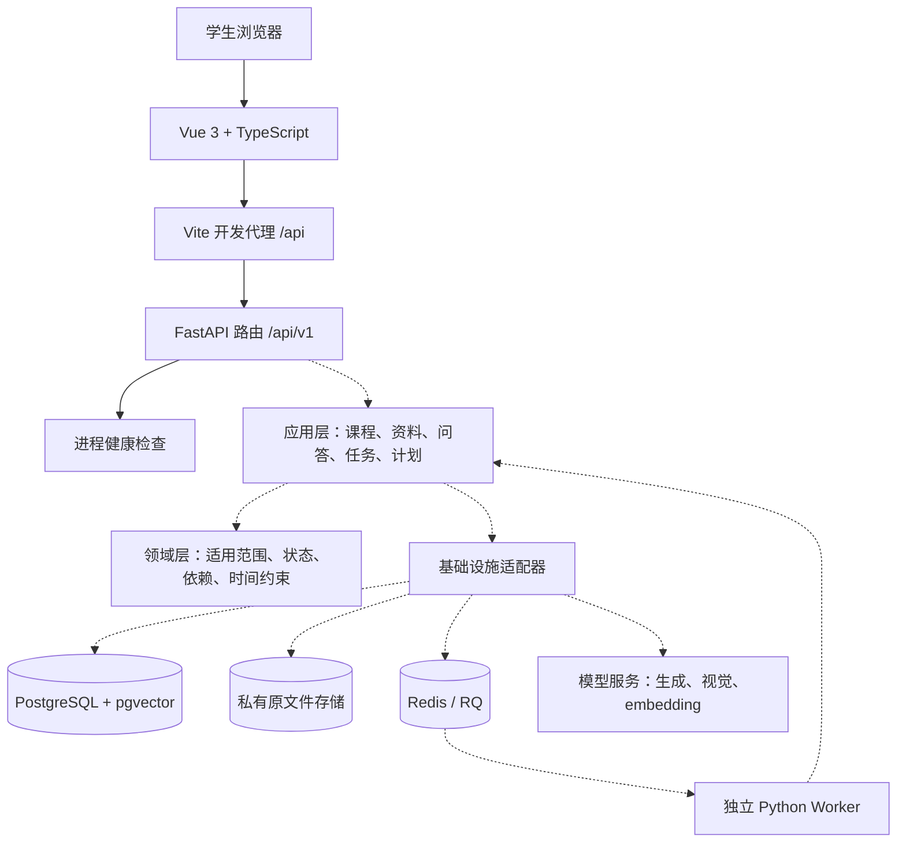
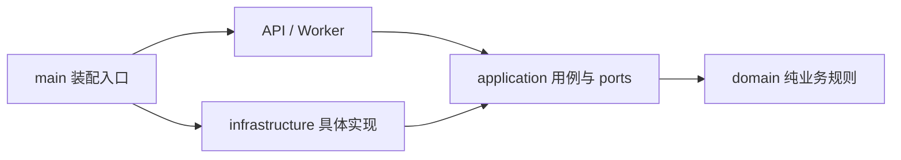
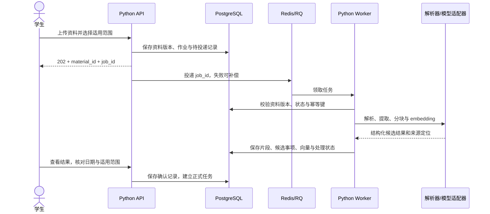

# CampusFlow 技术方案与项目架构

本文确定首期开发基线，业务范围以 [README](../README.md) 和 [AGENTS](../AGENTS.md) 为准。**当前实现仅包括前后端骨架、健康检查、配置和基础测试；数据库、资料处理、模型调用、排期和队列均待实现。**

## 1. 总体决策

采用单仓库、前后端分离、模块化单体架构。前端提供交互，Python 后端负责业务规则、资料处理与模型编排；耗时工作通过同一个后端包的独立 Worker 进程执行。

四人小组首期需要集中完成业务闭环，因此保持一套后端代码和一套数据模型。API 与 Worker 是不同进程，共享应用层用例，不单独维护微服务接口。仅为已经出现的业务边界增加抽象。

### 技术选型

| 层面 | 选择 | 原因与引入时机 |
| --- | --- | --- |
| 前端 | Vue 3 + TypeScript + Vite | 页面、组件与 API 调用分开，类型检查帮助维护接口；本次建立最小页面。多页时加 Vue Router，有共享状态需求时加 Pinia |
| Python 运行环境 | Python 3.12 + uv | 小组统一解释器小版本，使用 `pyproject.toml` 和 `uv.lock` 管理依赖；本次落地 |
| HTTP API | FastAPI + Uvicorn | Pydantic 请求／响应校验、OpenAPI 文档、路由拆分；本次实现 `/api/v1/health` |
| 配置 | pydantic-settings | 环境变量与本地 `.env` 注入，配置集中定义；本次落地 |
| 持久化 | PostgreSQL 17 + SQLAlchemy 2 + psycopg 3 + Alembic | 保存资料版本、引用、任务与计划；首个持久化功能时引入。默认同步 Session，HTTP 同步数据库路径使用 `def`，不得在 `async def` 中直接执行阻塞 I/O |
| 向量检索 | PostgreSQL 的 pgvector 扩展 | 语义向量与业务记录共享数据库，便于按课程、学期、资料版本过滤；RAG 阶段引入 |
| 文件存储 | 后端私有本地目录 + 存储接口 | 单实例开发先降低运维成本；文件元数据进数据库，原文件不进 Git。需要多实例时替换为 S3 兼容存储 |
| 资料解析 | pypdf + 可替换 OCR／多模态适配器 | PDF 文本优先直接提取；扫描件和复杂表格走识别流程，保留页码及定位；资料功能阶段引入 |
| AI 与 RAG | 应用层显式流程 + 模型适配接口 | 区分生成、多模态识别和 embedding 能力。具体供应商与模型待授权样本评估、费用和可用性验证后确定，不让 SDK 类型进入业务层 |
| 后台作业 | RQ + Redis 7 + Python Worker | 用于 PDF／图片处理、模型调用与索引；资料处理阶段引入。业务状态以 PostgreSQL 为准，Redis 不作为事实来源 |
| 质量检查 | pytest + HTTPX + Ruff；vue-tsc + Vite build | 后端接口和规则测试、格式与静态检查，前端类型检查和构建；本次提供可执行命令 |
| 部署 | 开发时本地双进程；后续 Docker Compose + 同源反向代理 | 持久化接入后添加数据库与 Worker；当前不提供公网生产部署 |

Python 版本写在 `backend/.python-version`，前端建议 Node 24（见 `.nvmrc`，最低 22.12）。应用依赖的精确版本以实际生成的 `uv.lock`、`package-lock.json` 为准，不手工修改锁文件。

### 暂不引入的组件

- Django 管理后台、微服务、Kubernetes：当前主要需求是学生侧 API 和资料处理，暂时没有相应运维或后台管理需求。
- LangChain／LangGraph 等编排框架：先把检索、引用校验和计划确认实现为明确的 Python 用例，需要复杂持久工作流时再评估。
- 独立向量数据库、Elasticsearch：先验证 PostgreSQL + pgvector 的效果；中文关键词检索与混合排序必须用中文样本评估，不假定默认全文检索配置足够。
- 本地大模型／GPU 部署：模型适配接口保留替换能力，首期不要求每个成员配置 GPU。
- UI 组件库、完整日历组件：具体页面原型确定后再引入，当前只有环境联通页。

## 2. 系统架构图

实线表示本次已实现的调用链，虚线表示目标 MVP 组件及连接。



开发前端通过 Vite 将 `/api` 转发到 `127.0.0.1:8000`，无需开放通配 CORS。生产目标由同一个域名提供前端静态文件和 `/api`，由反向代理替代 Vite。API、Worker、数据库和文件存储不直接暴露给浏览器。

当前健康接口仅表示 API 进程存活；接入数据库后另设 readiness 检查，不用 liveness 返回值宣称数据库或模型可用。

## 3. 文件分层

以下目录均已建立；标注“预留”的目录目前只包含职责说明，按真实用例逐步添加代码。

```text
CampusFlow/
├── README.md                    # 对外项目计划与开发入口
├── AGENTS.md                    # 业务及工程约定
├── CONTRIBUTING.md              # 小组贡献流程
├── .gitignore
├── backend/
│   ├── pyproject.toml           # Python 依赖与检查配置
│   ├── uv.lock                  # Python 精确依赖锁
│   ├── .python-version
│   ├── .env.example             # 可提交的配置示例
│   ├── src/campusflow/
│   │   ├── main.py              # 应用工厂、依赖装配、路由注册
│   │   ├── core/                # 配置与运行时通用设施
│   │   ├── api/                 # HTTP 路由与输入输出 schema
│   │   ├── application/         # 预留：业务用例与外部能力接口
│   │   ├── domain/              # 预留：纯业务对象与规则
│   │   ├── infrastructure/      # 预留：数据库、解析、模型、存储、队列
│   │   └── workers/             # 预留：后台作业入口
│   ├── migrations/             # 预留：Alembic 迁移
│   └── tests/                  # 接口及后续领域、集成测试
├── frontend/
│   ├── package.json
│   ├── package-lock.json
│   ├── .nvmrc
│   ├── vite.config.ts
│   ├── tsconfig.json
│   ├── index.html
│   └── src/
│       ├── main.ts              # 前端入口
│       ├── App.vue              # 应用根组件
│       ├── views/               # 页面
│       ├── components/          # 预留：跨页面共享组件
│       ├── api/                 # HTTP 调用与接口数据处理
│       └── styles.css
├── infra/                      # 预留：Compose 和部署配置
└── docs/
    ├── ARCHITECTURE.md          # 本文：选型、架构、边界
    ├── DEVELOPMENT.md           # 环境与执行命令
    └── GitLab.md                # 已有仓库连接说明
```

### 后端依赖方向



- `api` 只处理 HTTP 校验、依赖注入、调用用例与响应转换，不直接查库或调用模型。
- `application` 协调流程、事务与授权确认，依赖接口；按 `materials`、`qa`、`tasks`、`planning` 等业务组织文件。
- `domain` 不导入 FastAPI、ORM、供应商 SDK 或运行配置；日期与冲突规则可以脱离服务器独立测试。
- `infrastructure` 实现接口，SQLAlchemy 模型只在该层使用，不直接返回给前端。
- `main`／后续 Worker 启动模块负责组装具体依赖。健康检查无需经过空的 service 和 repository。
- 不预先创建十组空 CRUD 模块或通用基类；第一个实际用例确定后再增加必要文件。

前端页面只通过 `api/` 访问后端。跨页面路由与状态管理按需增加，后端返回的事实与执行结果为准，前端不能把演示数据当成真实任务。

## 4. 关键业务链路设计

### 资料到可查询事实（待实现）



上传时校验大小、类型和访问范围，服务端生成存储键，不直接使用用户文件名作为路径。原文件、页码／区域、提取文本和版本要可关联；多个片段不能丢失自己的引用位置。

数据库与队列无法假定原子提交：业务作业和待投递记录在同一事务内保存，投递器重试未投递记录；Worker 接受重复消息但不重复产生结果。失败、部分成功、超时与重试次数应可见，删除或替换的资料版本不得被晚到的任务重新写回索引。

### 检索、回答与计划（待实现）

1. 按工作空间、学期、教学班、资料有效状态过滤，再进行检索；不能先检索全部用户资料后再由模型判断权限。
2. 片段带稳定引用 ID 和版本。模型生成回答后校验引用 ID 存在且在候选集内；仅有合法 ID 不等于语义支持充分，还需用样本评估支持程度。
3. Agent 输出查询／规划／冲突检查意图和结构化参数，后端校验后调用固定用例；任意生成文本不能变成执行命令。
4. 已确认任务进入确定性排期器；先满足固定时间和截止约束，再应用偏好。模型可以解释或建议拆分，不能越过约束验证。
5. 计划以带版本的草案保存；接受操作检查草案版本，过期草案需重新比较，避免覆盖较新的安排。
6. 第三阶段的外部日历适配器仅接受已确认的具体操作，并保存幂等键、外部事件 ID 和逐项结果。

## 5. 数据与接口边界

目标数据分组如下，具体字段和迁移在功能实现时确定：

| 分组 | 对象 | 约束重点 |
| --- | --- | --- |
| 学习背景 | Workspace、Semester、Course | 单用户首期仍保留工作空间边界，同名教学班分开 |
| 证据链 | Material、MaterialVersion、SourceChunk、Citation | 引用绑定版本与定位，原文件放存储，元数据与向量放数据库 |
| 事实与行动 | ExtractedItem、Rule、Task、Event | 核对状态与执行状态分开，DDL 与固定活动时间分开 |
| 计划 | PlanDraft、PlanVersion、TimeBlock、Conflict | 草案与接受状态、乐观版本检查、任务与时间块关联 |
| 后台作业 | ProcessingJob、Outbox | 幂等、重试、待投递补偿、资料失效检查 |
| 外部操作（第三阶段） | Confirmation、ExternalOperation | 确认范围、内容版本、幂等与实际结果 |

统一接口前缀为 `/api/v1`，使用 JSON 与 OpenAPI。未来上传使用 multipart；长任务返回 `202` 和作业 ID，首期通过轮询查看状态，不先引入 WebSocket。

时间采用带时区的 ISO 8601 表示，数据库时间点使用 `timestamptz`，另存原始文本与来源时区。只有日期而没有时刻的 DDL 保留日期精度，不伪装成午夜或 23:59 的确定时间。学校教学周需依赖适用校历换算。

业务错误未来统一为稳定错误码、可读消息和请求 ID；当前仅健康接口，未知路由沿用 FastAPI 的 `404`。模型密钥只在后端配置，日志避免原始资料全文和个人信息。

当前骨架未实现认证，只监听本机地址。引入真实学习资料或共享部署前，必须实现身份校验与工作空间访问控制；“单用户”不等于可以把资料公开访问。

## 6. 实施顺序与完成条件

1. **骨架（本次）：** 前端调用真实健康接口，后端 OpenAPI 可访问，配置可覆盖，后端测试与前端构建可执行。
2. **首个持久化切片：** PostgreSQL、Alembic、工作空间与课程、手动任务；用真实数据库测试迁移、事务与课程范围，避免用 SQLite 代替 pgvector 集成验证。
3. **资料切片：** 私有文件存储、RQ Worker、解析与来源定位、事项核对；验证失败重试与删除后的索引失效。
4. **问答切片：** embedding、检索、模型适配器、带引用回答；用中文授权样本评估缺失信息和来源冲突。
5. **计划切片：** 固定日程、可用时间、两周计划、冲突检查与草案接受，完成业务 MVP 验收。

上述是第一阶段内部的工程实施顺序，不改变 README 对第二、第三阶段的功能边界。后续引入的依赖在实际使用时加入锁文件；本次不为未实现能力预装整套 AI 和数据库 SDK。

## 7. 官方资料

- [Vue 快速开始](https://vuejs.org/guide/quick-start)、[TypeScript 支持](https://vuejs.org/guide/typescript/overview)、[Vite 入门](https://vite.dev/guide/)：前端工程基线。
- [FastAPI 多文件组织](https://fastapi.tiangolo.com/tutorial/bigger-applications/)：路由拆分；[后台任务边界](https://fastapi.tiangolo.com/tutorial/background-tasks/)：区分进程内任务与独立作业系统。
- [uv 项目管理](https://docs.astral.sh/uv/guides/projects/)：环境和依赖管理；[锁定与同步](https://docs.astral.sh/uv/concepts/projects/sync/)：团队安装使用 `--locked`。
- [SQLAlchemy ORM](https://docs.sqlalchemy.org/en/20/orm/quickstart.html)、[Alembic](https://alembic.sqlalchemy.org/en/latest/)、[pgvector](https://github.com/pgvector/pgvector)：关系数据、迁移和向量存储。
- [RQ](https://python-rq.org/)：Python 作业队列；[pypdf 文本提取](https://pypdf.readthedocs.io/en/stable/user/extract-text.html)：解析能力及 OCR 边界。
