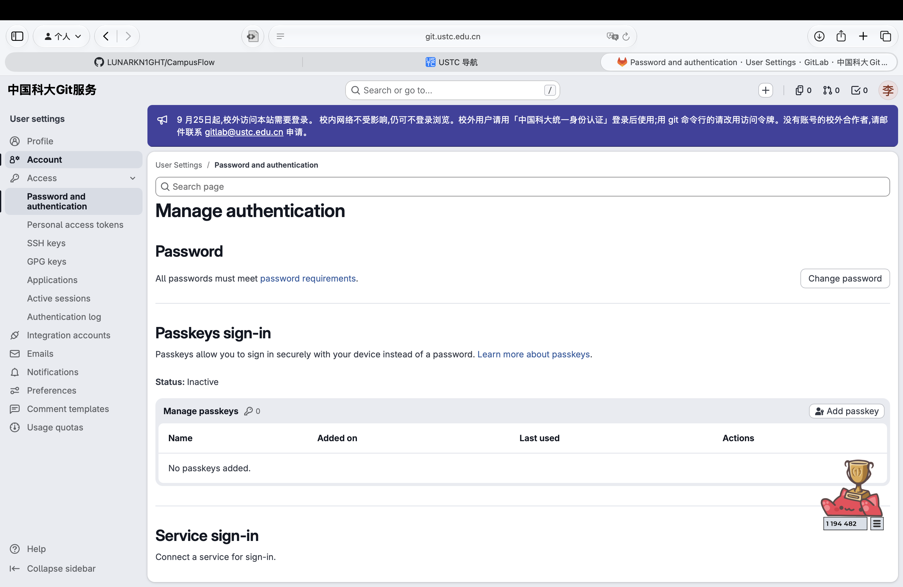

# GitLab 链接

## 1. 本地 Git 初始化

> 前提：务必完成本地 Git 的安装！如果没有完成可以参考我在 AIA 里面发的 Git 教程】

GitLab 可能会多涉及一个配密钥的过程，需要在 User‘s Setting 下面申请一个密钥然后在本地配置。



如果之前本地配置过 Git，这一步也可以跳过。

## 2. clone 仓库

确认上面没有问题后，在自己电脑中开一个**空的**文件夹，用 VSCOde 打开这个文件夹。打开终端，并输入下面命令：

```bash
git clone git@git.ustc.edu.cn:lyf0402/campusflow.git
```

另一方面，Git 是支持多远程的，我在 GitHub 上也建了仓。愿意两边同时使用的可以用下面的命令分别挂 remote。

```bash
git remote add origin https://github.com/LUNARKN1GHT/CampusFlow.git
git remote add school git@git.ustc.edu.cn:lyf0402/campusflow.git
```

之后在 `push` 或 `pull` 等操作的时候，后面加上仓库名称就好。

> 如果你实在不会，只需配置一个学校的 GitLab 就好。配置问题不要乱动！
